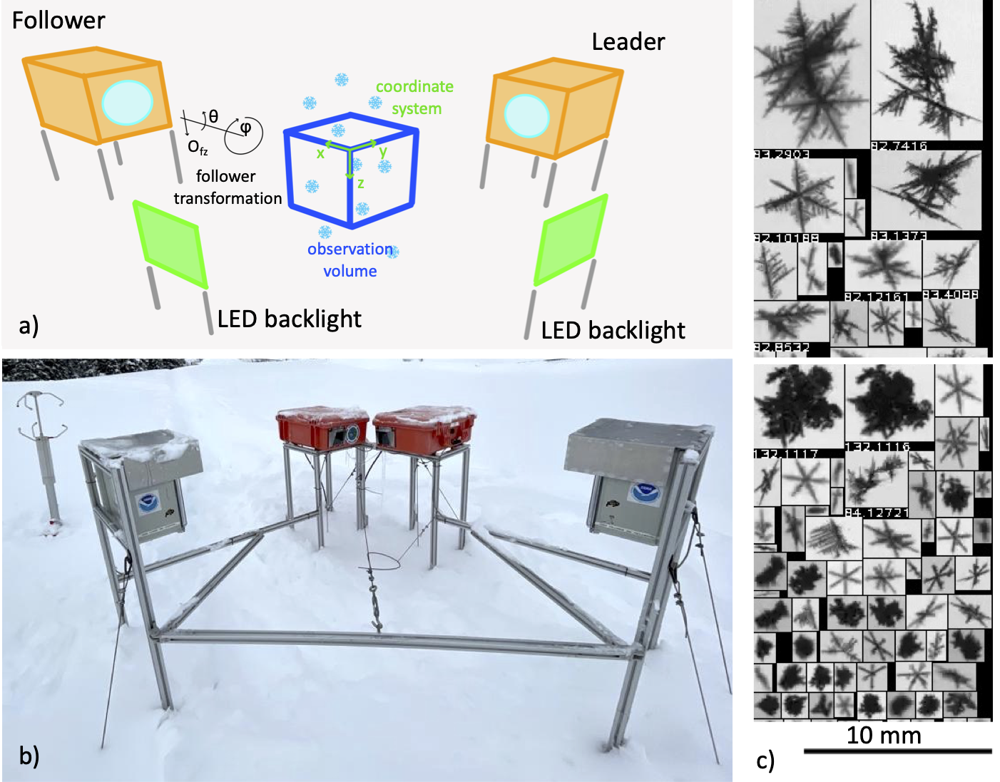

.. VISSSlib documentation master file, created by
   sphinx-quickstart on Tue Apr  9 10:12:49 2024.
   You can adapt this file completely to your liking, but it should at least
   contain the root `toctree` directive.

Welcome to VISSSlib's documentation!
====================================

Processing library for the Video In Situ Snowfall Sensor.

Maahn, M., D. Moisseev, I. Steinke, N. Maherndl, and M. D. Shupe, 2024: Introducing the Video In Situ Snowfall Sensor (VISSS). Atmospheric Measurement Techniques, 17, 899–919, `doi:10.5194/amt-17-899-2024 <https://amt.copernicus.org/articles/17/899/2024/>`_. 

.. note::

   This project is under active development. The documentation is incomplete.

.. toctree::
   :hidden:
   :maxdepth: 1

   data_acquisition
   installation
   processing
   metaRotation
   matching
   config_files
   api

   a) Concept drawing of the VISSS (not to scale with enlarged
   observation volume). See Sections `2.2 <#sec:matching>`__ and
   `2.3 <#sec:rotation>`__ for a discussion of the joint coordinate
   system and the transformation of the follower’s coordinate system,
   respectively. b) First generation VISSS deployed at Gothic, Colorado
   during the SAIL campaign (Photo by Benn Schmatz), c) Randomly
   selected particles observed during MOSAiC on 15 November 2019 between
   6:53 and 11:13 UTC.

Indices and tables
==================

* :ref:`genindex`
* :ref:`modindex`
* :ref:`search`
