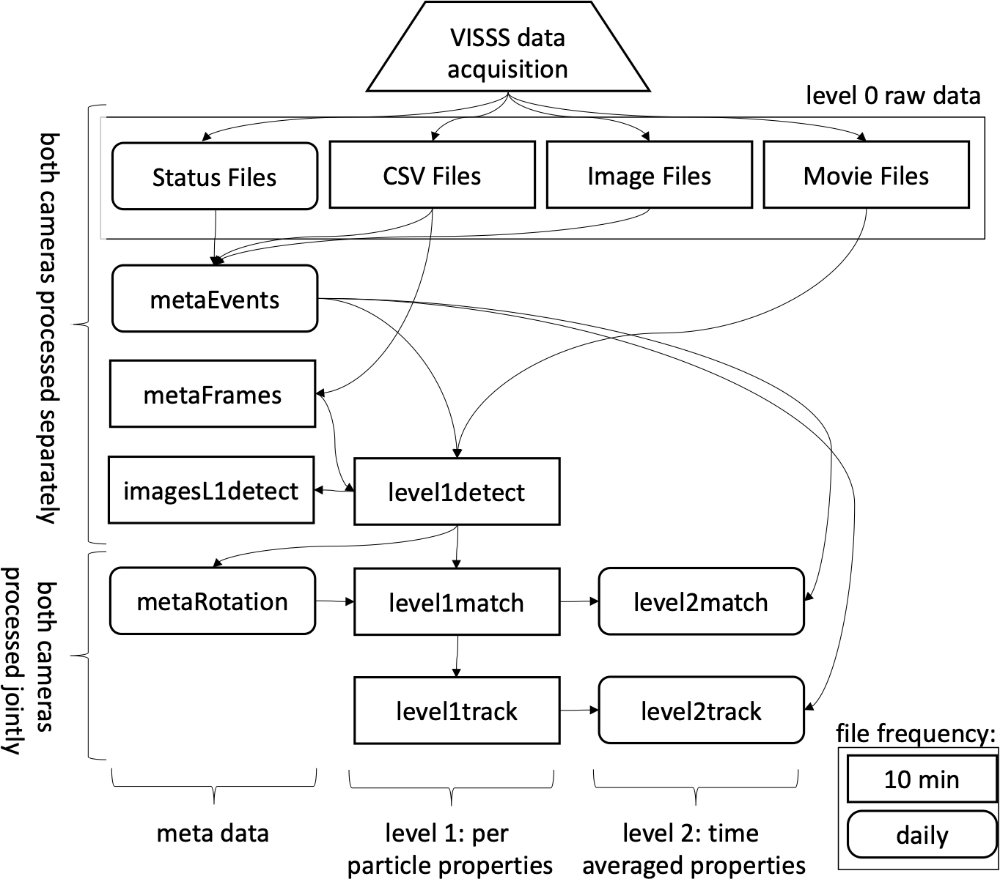

Processing
==========

The cameras transmit every captured image to the data acquisition
systems which are standard desktop computers running Linux. Based on
simple brightness changes, the computers save only moving images and
discard all other data (this was not implemented for MOSAiC yet). The
raw data of the VISSS consists of the video files (mov or mkv video
files with h264 compression), the first recorded frame as an image (jpg
format) for quick evaluation of camera blocking, and a csv file with the
timestamps of the camera (capture_time) as well as the computer
(record_time) and other meta information for each frame. The cameras run
continuously and new files are created every 10 minutes (5 minutes for
MOSAiC). In addition, a daily status csv file is maintained that
contains information about software start and stop times and when new
files were created. Both cameras record completely separately which
requires an accurate synchronization of the camera and computer clocks
for matching the observations of a single particle. 

   Flowchart of VISSS data processing. Daily products have rounded
   corners, 10-minute resolution products have square corners.

Obtaining particle properties from the individual VISSS video images
requires (1) detecting the particles, (2) matching the observations of
the two cameras, and (3) tracking the particles over multiple frames to
estimate the fall velocities. The Level 1 products contain per-particle
properties in pixel units using (1) a single camera, (2) matched
particles from both cameras, and (3) exploiting particles tracked in
time. For the Level 2 products, the Level 1 observations are calibrated
(i.e., converted from pixel in metric units) and distributions of
particle size, aspect ratio, and other properties are estimated based on
the per-particle properties. In addition to the Level 1 and Level 2
products, there are metadata products: metaEvents is a netcdf version of
the status files along with a camera blocking estimate based on the jpg
images. metaFrames is a netcdf version of the csv file. metaRotation
keeps track of the camera misalignment as detailed below. The
imagesL1detect product contains images of the detected particles which
is required for creating quicklooks like Fig. `1 <#fig:concept>`__.c. 

In the following, the processing of the Level 1 and Level 2 products is
described in detail (Fig. `2 <#fig:processing>`__). [*]_

Description of the products

.. toctree::
   :maxdepth: 1

   metaRotation
   matching

``VISSSlib.scripts`` API
------------------------

Various products at different levels need to be processed, tzypically by running a covenience function to ``VISSSlib.scripts``. See the ``scripts`` folder
for sample shell scripts. 

.. automodule:: VISSSlib.scripts
    :members:
    :undoc-members:
    :show-inheritance:
    :member-order: bysource

.. [*] The former text has been copied from Maahn, M., D. Moisseev, I. Steinke, N. Maherndl, and M. D. Shupe, 2024: Introducing the Video In Situ Snowfall Sensor (VISSS). Atmospheric Measurement Techniques, 17, 899–919, doi:10.5194/amt-17-899-2024.

