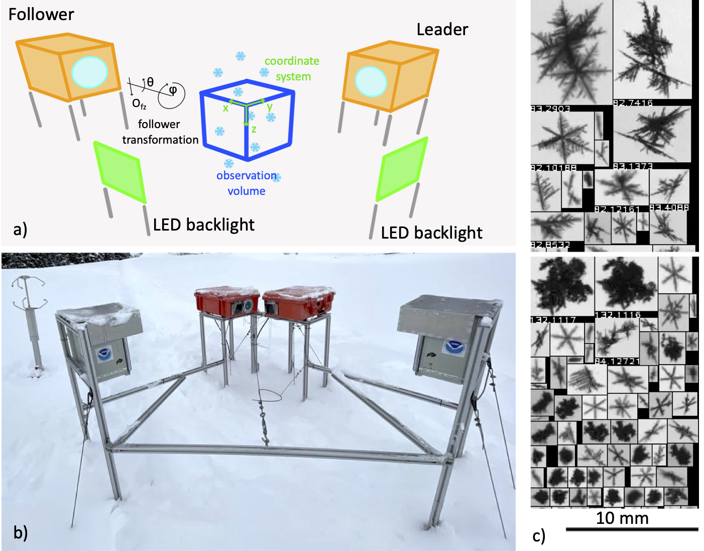

=====================================================
Instrument hardware background
=====================================================

This page used to reproduce the full VISSS paper. Most of that content
(the particle detection, matching, rotation-retrieval, tracking, and
calibration algorithms) is now covered where it belongs, next to the code
that implements it: see :doc:`detection`, :doc:`matching`,
:doc:`metaRotation`, :doc:`tracking`, :doc:`distributions`, and
:doc:`calibration`. The paper's validation/instrument-comparison results
(VISSS vs. PIP vs. Parsivel) aren't reproduced here at all — they're not
relevant to using or modifying this library, and they'd only go stale as a
copy. For that material, and for the full scientific write-up, see the
published paper:

    Maahn, M., D. Moisseev, I. Steinke, N. Maherndl, and M. D. Shupe, 2024:
    Introducing the Video In Situ Snowfall Sensor (VISSS). Atmospheric
    Measurement Techniques, 17, 899–919,
    `doi:10.5194/amt-17-899-2024 <https://amt.copernicus.org/articles/17/899/2024/>`_.

What's kept here is the hardware background that isn't tied to any
particular module — the physical camera/lens/backlight setup and the three
instrument generations — since nothing else in this documentation covers
it.

.. _`sec:hardware`:

Instrument design
=================

The VISSS consists of two camera systems oriented at a 90° angle to the
same measurement volume (Fig. `1 <#fig:concept-hw>`__). Both cameras work
using the Complementary Metal Oxide Semiconductor (CMOS) global shutter
principle and use a resolution of 1280x1024 gray-scale pixels and a
frame rate of 140 Hz (250 Hz since the 2nd generation). One camera acts
as the leader, sending trigger signals to both the follower camera and
the two LED backlights that illuminate the scenes from behind with a
350,000 lux flash. Green backlights (530 nm) were chosen because the
camera and lenses are optimized for visual light. The leader-follower
setup results in a slight delay in the start of exposure between the two
cameras. To compensate for this, the background LEDs are turned on for a
duration of 60 s only when the exposure of both cameras is active. Thus,
the 60 s flash of the backlights determines the effective exposure time
of the camera as long as there is no bright sunlight, which is a rare
condition during precipitation.

The two camera-lens-backlight combinations are at a 90° angle so that
particles are observed from two perspectives, reducing sizing errors. For
the VISSS, the accuracy of the measurements can be further improved by
taking advantage of the fact that the VISSS typically observes 8 to 11
frames of each particle (assuming a sedimentation velocity of 1 m
s\ :math:`^{-1}` and a frame rate of 140 to 250 Hz), and additional
perspectives can be obtained from the natural tumbling of the particle.

Telecentric lenses have a constant magnification within the usable depth
of field, eliminating sizing errors. Consequently, the lens aperture
must be as large as the observation area, making the lens bulky, heavy
and expensive. For the first VISSS (VISSS1), a lens with a magnification
of 0.08 was chosen, resulting in a pixel resolution of 58.75 m
px\ :math:`^{-1}` (Table `1 <#tab:specs>`__). The working distance, i.e.
the distance from the edge of the lens to the center of the observation
volume, is 227 mm. This partly undermines the goal of having an
instrument with an observation volume that is not obstructed by
turbulence induced by nearby structures, but was caused by budget
limitations. It also does not allow for sufficiently large roofs over
the camera windows to protect against snow accumulation in all weather
conditions. This problem was partially solved by the increased budget
(22 kEUR) for the second generation VISSS2, which used a 600 mm working
distance lens as well as a camera with an increased frame rate of 250 Hz
and a pixel resolution of 43.125 m px\ :math:`^{-1}`. However, the
optical quality of the lens proved to be borderline for the
applications, resulting in an estimated optical resolution of
approximately 50 m and slightly blurred particle images. Consequently,
the lens was changed again for the third generation VISSS3 (currently
under construction), which has a working distance of 1300 mm. Image
quality is potentially also impacted by motion blur and the exposure
time of 60 s was selected to limit motion blur of particles falling at
1 m/s to 1.02 and 1.44 px for VISSS1 and VISSS2, respectively. Particle
blur can also occur when particles are not exactly in focus of the
lenses. The maximum circle of confusion is 1.3 px at the edges of the
observation volume.

The lens-camera combinations and backlights are housed in waterproof
enclosures that are heated to :math:`-`\ 5°C and 10°C, respectively. The
low temperature in the camera housing is to prevent melting and
refreezing of particles on the camera window.

The cameras of VISSS1 and VISSS2 are connected to the data acquisition
systems via separate 1 Gbit and 5 Gbit Ethernet connections,
respectively. Due to the increased frame rate, two separate systems are
required to record data in real-time for VISSS2.

   a) Concept drawing of the VISSS (not to scale with enlarged
   observation volume). b) First generation VISSS deployed at Gothic,
   Colorado during the SAIL campaign (Photo by Benn Schmatz), c) Randomly
   selected particles observed during MOSAiC on 15 November 2019 between
   6:53 and 11:13 UTC.

.. container::
   :name: tab:specs

   .. table:: Technical specifications of the three VISSS instruments.

      +----------------+----------------+----------------+----------------+
      |                | VISSS1         | VISSS2         | VISSS3         |
      |                |                |                | (preliminary)  |
      +================+================+================+================+
      | Pixel          | 58.75          | 43.125         | 46.0           |
      | resolution [m  |                |                |                |
      | px\            |                |                |                |
      | :math:`^{-1}`] |                |                |                |
      +----------------+----------------+----------------+----------------+
      | Obs. volume (w | 75.2 x 75.2 x  | 55.2 x 55.2 x  | 58.9 x 58.9 x  |
      | x d x h) [mm]  | 60.1           | 44.2           | 47.1           |
      +----------------+----------------+----------------+----------------+
      | Used frame     | 1280 x 1024    | 1280 x 1024    | 1280 x 1024    |
      | size [px]      |                |                |                |
      +----------------+----------------+----------------+----------------+
      | Frame rate     | 140            | 250            | 270            |
      | [Hz]           |                |                |                |
      +----------------+----------------+----------------+----------------+
      | Effective      | 60             | 60             | 60             |
      | exposure time  |                |                |                |
      | [s]            |                |                |                |
      +----------------+----------------+----------------+----------------+
      | Working        | 227 mm         | 600 mm         | 1300 mm        |
      | distance [mm]  |                |                |                |
      +----------------+----------------+----------------+----------------+
      | Camera         | Teledyne Genie | Teledyne Genie | Teledyne Genie |
      |                | Nano M1280     | Nano 5G M2050  | Nano 5G M2050  |
      |                | Mono           | Mono           | Mono           |
      +----------------+----------------+----------------+----------------+
      | Lens           | Opto           | Sill S5LPJ1235 | Sill S5LPJ1725 |
      |                | Engineering    | (with modified | (with modified |
      |                | TC12080        | working        | working        |
      |                |                | distance)      | distance)      |
      +----------------+----------------+----------------+----------------+
      | F Value        | 8              | 8              | 9.6            |
      +----------------+----------------+----------------+----------------+
      | Maker          | University of  | University of  | Leipzig        |
      |                | Colorado       | Cologne        | University     |
      |                | Boulder        |                |                |
      +----------------+----------------+----------------+----------------+
      | Deployments    | MOSAiC         | Ny-Ålesund, NO | Hyytiälä, FI   |
      |                | 2019/20;       | since 2021     | 2023/24        |
      |                | Hyytiälä, FI   |                |                |
      |                | 2021/22; SAIL, |                |                |
      |                | USA 2022/23;   |                |                |
      |                | Eriswil, CH    |                |                |
      |                | 2023/24        |                |                |
      +----------------+----------------+----------------+----------------+
